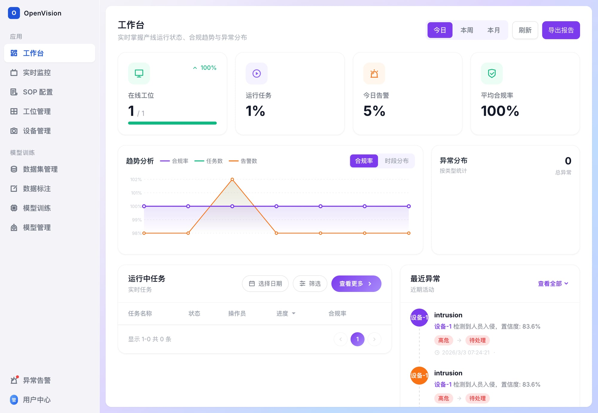
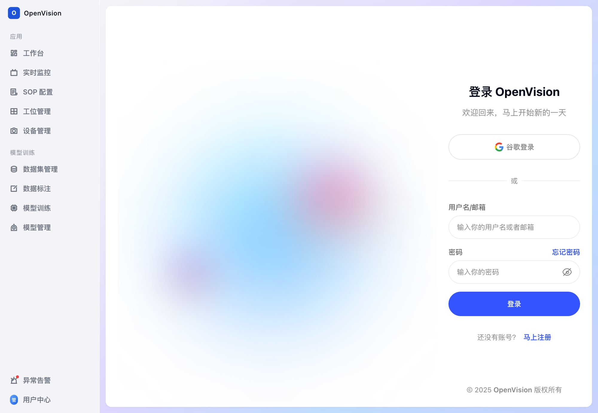
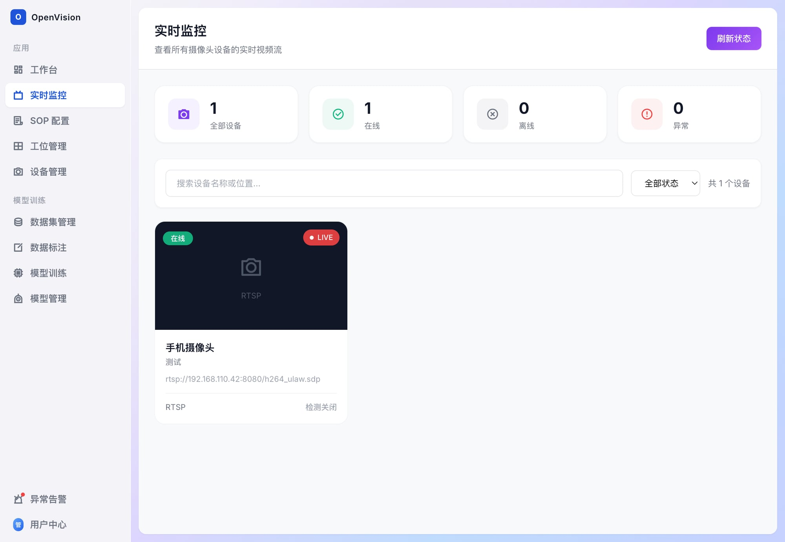
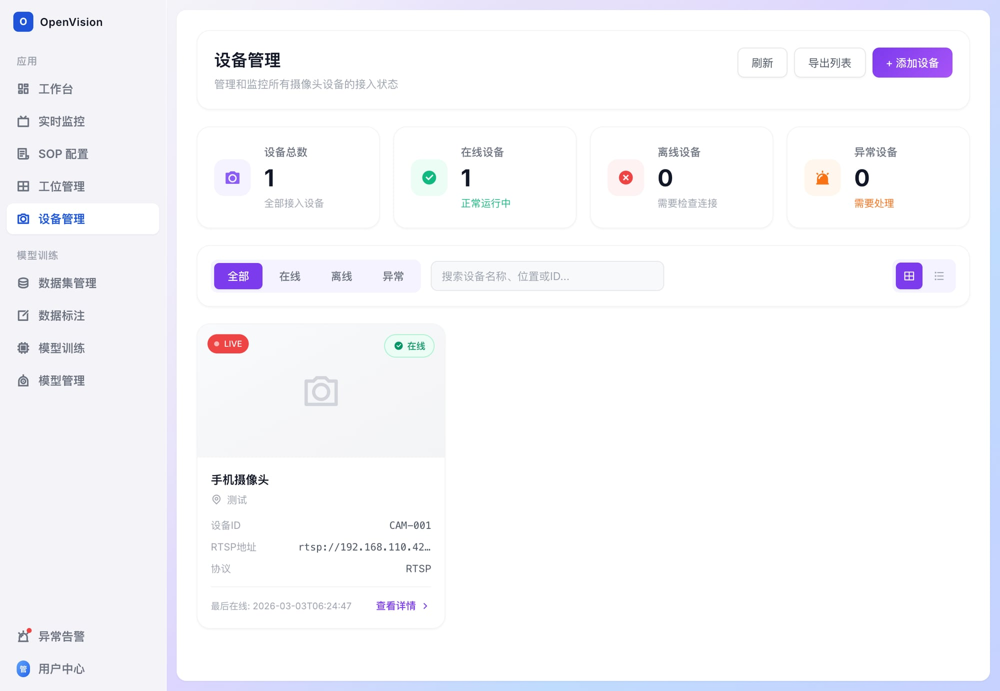

# OpenVision

**The open-source, self-hosted AI camera platform.**

Manage all your cameras in one place. Detect what matters. Keep your data local.



OpenVision unifies IP cameras from any brand into a single dashboard with built-in AI — object detection, facial recognition, and behavior analysis — all running locally on your hardware. No cloud subscriptions. No vendor lock-in. No compromises.

---

## Why OpenVision?

- 🎯 **Unified Management** — One dashboard for every camera brand. No more juggling 5 different apps.
- 🧠 **Built-in AI** — Person, vehicle, and object detection. Face recognition and behavior analysis on the roadmap.
- 🔒 **Self-hosted & Private** — Your footage stays on your hardware. Period.
- ⚡ **Easy Setup** — Web-based dashboard, no YAML config files. Add a camera in 30 seconds.
- 🏠 **For Everyone** — From home security DIYers to small business owners.

---

## Quick Start

```bash
git clone https://github.com/mossepoch/OpenVision.git
cd OpenVision
docker-compose up -d
```

Or run locally:

```bash
npm install
npm run dev
```

Default: `http://localhost:3000`

---

## Screenshots

### Login


### Dashboard


### Real-time Monitoring


### Device Management


---

## Key Features

- **Multi-protocol Camera Access** — RTSP / ONVIF / HTTP-FLV / GB28181
- **Real-time Object Detection** — Person, vehicle, item, and behavior recognition
- **Smart Alerts** — Multi-channel notifications for events
- **Data Annotation & Training** — Built-in workflow for model improvement
- **Edge-Cloud Synergy** — Distributed inference and device management
- **Reports & Compliance** — Analytics and audit-ready reporting

---

## Tech Stack

- **Frontend:** React 19 + TypeScript + Vite 7
- **Styling:** Tailwind CSS
- **State:** React Router + Context
- **Charts:** Recharts
- **i18n:** i18next

---

## Roadmap

- [ ] Face recognition module
- [ ] Behavior analysis (loitering, fall detection, etc.)
- [ ] Mobile app (iOS/Android)
- [ ] Home Assistant integration
- [ ] One-click deploy scripts

---

## Contributing

We're building in public and early stage. Your feedback shapes what we build next.

- Open an issue for bugs or feature requests
- PRs are welcome
- Join the discussion in Discord

---

## License

Apache License 2.0 — See [LICENSE](LICENSE) for details.

---

**Built with ❤️ by the OpenVision Team**
